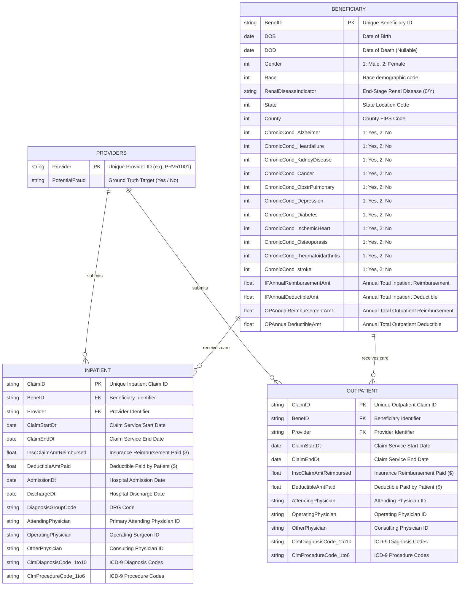
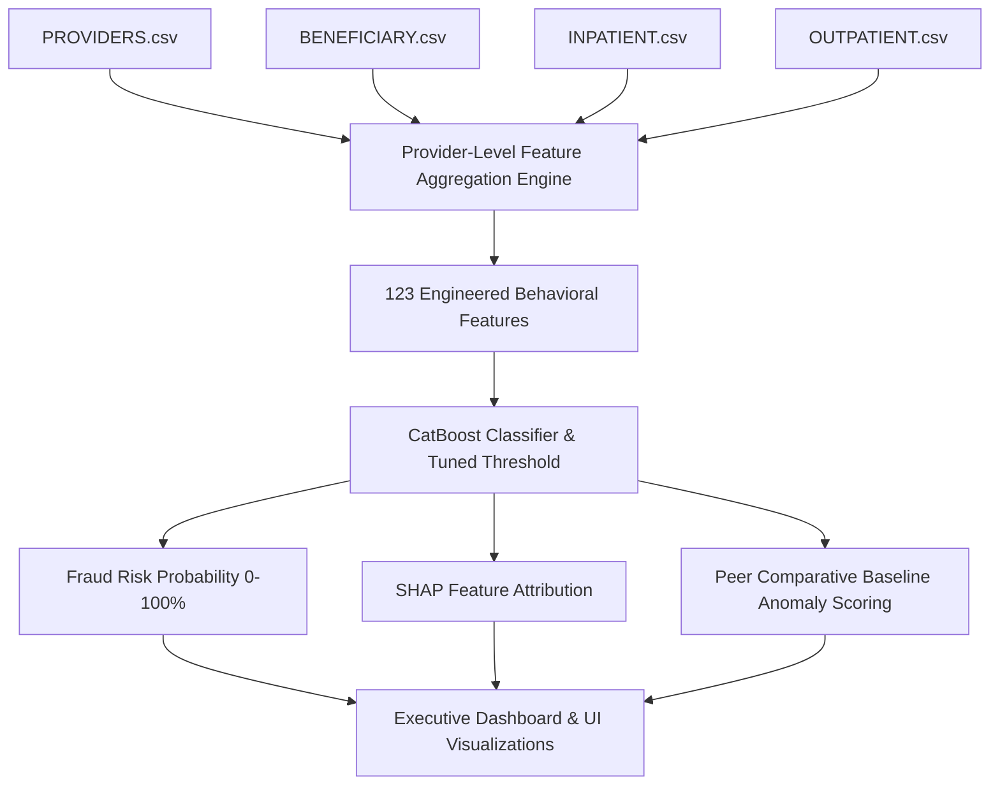

# Healthcare Insurance Claim Fraud Detection
## Data Dictionary, Entity Relationships & Analytical Architecture

---

## 1. Executive Summary & Problem Understanding

Healthcare insurance fraud incurs tens of billions of dollars in annual losses, directly increasing healthcare costs, depleting public funds (Medicare/Medicaid), and straining healthcare infrastructure.

Fraud is primarily committed at the **Healthcare Provider level** through sophisticated behavioral schemes:
1. **Upcoding & Inflated Reimbursements**: Billed diagnostic/treatment codes are systematically elevated to higher reimbursement brackets than warranted.
2. **Phantom Billing & Ghost Claims**: Incurring claims for patients without actual clinical consultations or inpatient stays.
3. **Excessive Inpatient Admissions**: Unnecessarily converting outpatient clinical visits into overnight hospital admissions.
4. **Beneficiary Churn & Revisit Loops**: Systematically recycling the same patient IDs across multiple high-value claims.
5. **Physician Concentration Anomalies**: Funneling disproportionate claim volumes through a single attending or operating physician.

This solution ingests and merges the four core CMS claims tables, calculates **120+ provider-level behavioral features**, scores fraud risk using a calibrated **CatBoost ML classifier**, and delivers a **human-explainable risk assessment score (0-100%)** with peer comparative benchmarks.

---

## 2. Entity-Relationship Model (ERD)

---

## 3. Detailed Data Dictionary

### Table 1: `PROVIDERS.csv`
| Column Name | Key / Role | Data Type | Nullable | Description |
| :--- | :--- | :--- | :--- | :--- |
| `Provider` | **Primary Key** | String | No | Unique alphanumeric healthcare provider ID (e.g. `PRV51001`). |
| `PotentialFraud` | **Target Label** | String | No (Train) | Classification label: `"Yes"` (Fraudulent) or `"No"` (Legitimate). |

### Table 2: `BENEFICIARY.csv`
| Column Name | Key / Role | Data Type | Nullable | Description |
| :--- | :--- | :--- | :--- | :--- |
| `BeneID` | **Primary Key** | String | No | Unique beneficiary/patient ID. |
| `DOB` | Attribute | Date | No | Date of birth for age and mortality features. |
| `DOD` | Attribute | Date | Yes | Date of death (used for deceased patient billing fraud checks). |
| `Gender` | Attribute | Integer | No | Gender indicator: `1` (Male), `2` (Female). |
| `Race` | Attribute | Integer | No | Demographic race category code (1-5). |
| `RenalDiseaseIndicator`| Attribute | String | No | End-stage renal disease indicator (`'0'` or `'Y'`). |
| `State` | Attribute | Integer | No | Geographic State code of beneficiary residence. |
| `County` | Attribute | Integer | No | County FIPS identifier. |
| `ChronicCond_*` (11 cols)| Attribute | Binary | No | Chronic disease indicators: Alzheimer's, Heart Failure, Kidney Disease, Cancer, COPD, Depression, Diabetes, Ischemic Heart, Osteoporosis, Rheumatoid Arthritis, Stroke (`1`: Yes, `2`: No). |
| `IPAnnualReimbursementAmt`| Attribute | Float | No | Annual aggregate inpatient claims reimbursed. |
| `IPAnnualDeductibleAmt` | Attribute | Float | No | Annual aggregate inpatient deductible paid. |
| `OPAnnualReimbursementAmt`| Attribute | Float | No | Annual aggregate outpatient claims reimbursed. |
| `OPAnnualDeductibleAmt` | Attribute | Float | No | Annual aggregate outpatient deductible paid. |

### Table 3: `INPATIENT.csv`
| Column Name | Key / Role | Data Type | Nullable | Description |
| :--- | :--- | :--- | :--- | :--- |
| `ClaimID` | **Primary Key** | String | No | Unique alphanumeric claim ID. |
| `BeneID` | **Foreign Key** | String | No | References `BENEFICIARY.BeneID`. |
| `Provider` | **Foreign Key** | String | No | References `PROVIDERS.Provider`. |
| `ClaimStartDt` | Attribute | Date | No | Service start date. |
| `ClaimEndDt` | Attribute | Date | No | Service end date. |
| `InscClaimAmtReimbursed`| Metric | Float | No | Primary financial insurance payout amount. |
| `DeductibleAmtPaid` | Metric | Float | Yes | Deductible copayment paid by patient. |
| `AdmissionDt` | Attribute | Date | No | Hospital admission date. |
| `DischargeDt` | Attribute | Date | No | Hospital discharge date. |
| `DiagnosisGroupCode`| Categorical | String | Yes | Diagnosis Related Group (DRG) code. |
| `AttendingPhysician` | Attribute | String | Yes | Primary attending clinician ID. |
| `OperatingPhysician` | Attribute | String | Yes | Surgical/operating physician ID. |
| `OtherPhysician` | Attribute | String | Yes | Consulting physician ID. |
| `ClmDiagnosisCode_1 to 10`| Categorical | String | Yes | ICD-9 primary and secondary diagnosis codes. |
| `ClmProcedureCode_1 to 6`| Categorical | String | Yes | ICD-9 surgical and clinical procedure codes. |

### Table 4: `OUTPATIENT.csv`
| Column Name | Key / Role | Data Type | Nullable | Description |
| :--- | :--- | :--- | :--- | :--- |
| `ClaimID` | **Primary Key** | String | No | Unique outpatient claim ID. |
| `BeneID` | **Foreign Key** | String | No | References `BENEFICIARY.BeneID`. |
| `Provider` | **Foreign Key** | String | No | References `PROVIDERS.Provider`. |
| `ClaimStartDt` | Attribute | Date | No | Outpatient visit start date. |
| `ClaimEndDt` | Attribute | Date | No | Outpatient visit end date. |
| `InscClaimAmtReimbursed`| Metric | Float | No | Outpatient reimbursement amount paid. |
| `DeductibleAmtPaid` | Metric | Float | Yes | Outpatient deductible paid. |
| `AttendingPhysician` | Attribute | String | Yes | Attending physician ID. |
| `OperatingPhysician` | Attribute | String | Yes | Operating physician ID. |
| `OtherPhysician` | Attribute | String | Yes | Consulting clinician ID. |
| `ClmDiagnosisCode_1 to 10`| Categorical | String | Yes | ICD-9 diagnosis codes. |
| `ClmProcedureCode_1 to 6`| Categorical | String | Yes | ICD-9 procedure codes. |

---

## 4. Multi-Table Merge & Feature Transformation Pipeline

